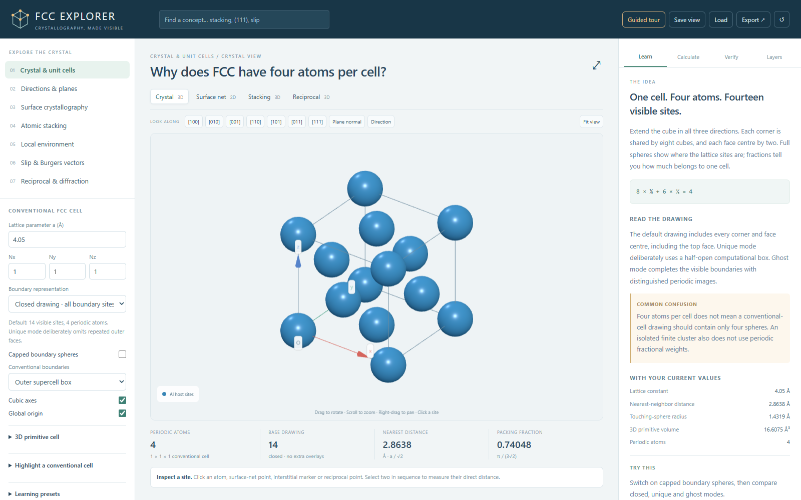
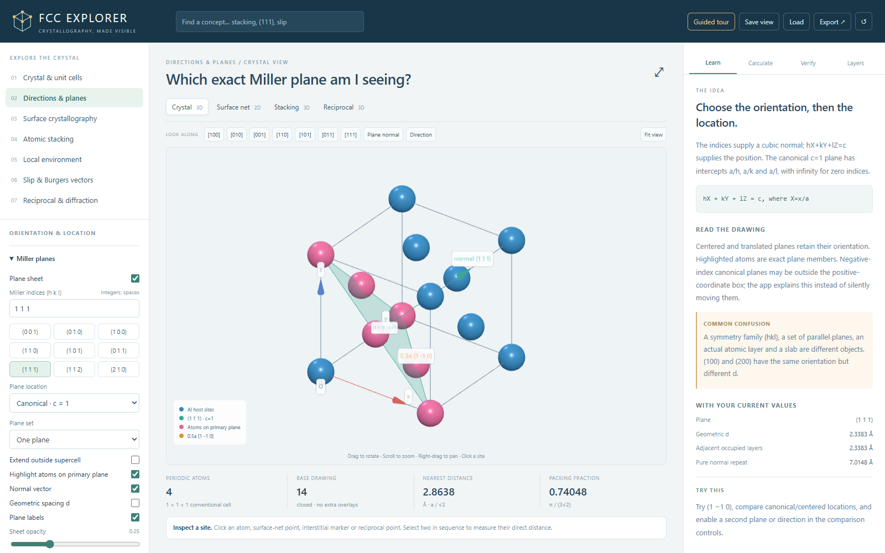
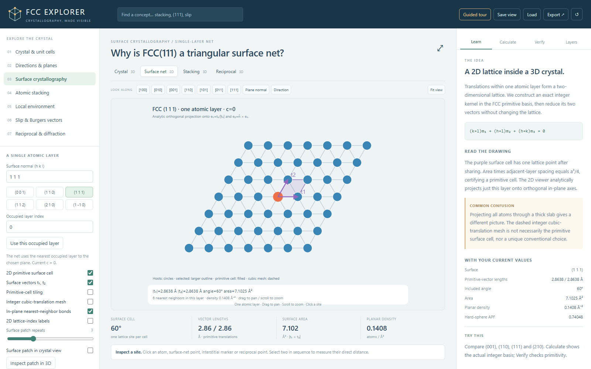
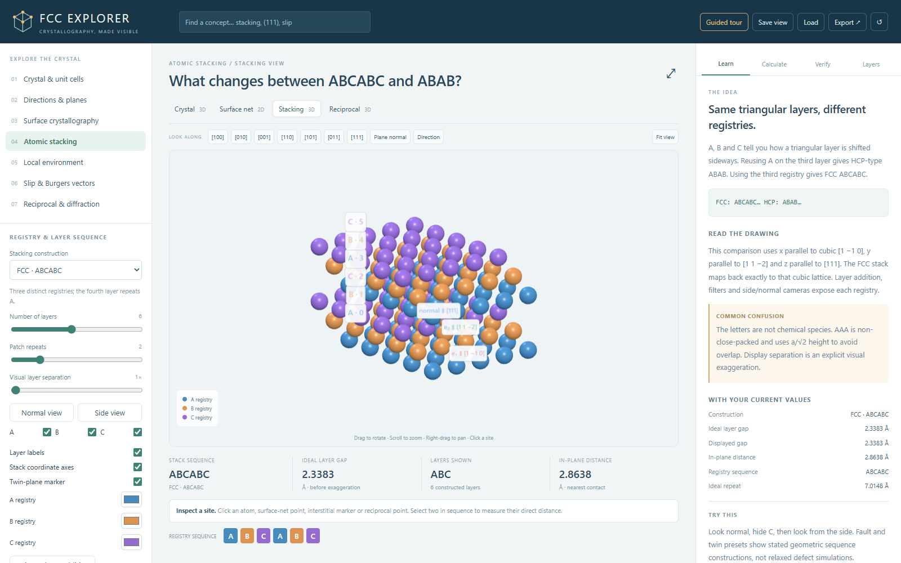

<div align="center">

# FCC Crystallography Explorer

**Crystallography, made visible.**

An interactive 3D lab for the face-centered cubic (FCC) crystal: unit cells, Miller planes, surfaces, stacking, neighbors, slip and diffraction. Every picture comes with its math.

[](LICENSE)
[](https://threejs.org/)


[](https://colab.research.google.com/github/solayman-bd/fcc-crystallography-explorer/blob/main/FCC-Explorer-Colab.ipynb)



</div>

## Why I built this

Textbook pictures of FCC are easy to misread. "4 atoms" and "14 balls" are both right, but they count different things. A plane slice and a projection along [hkl] look alike but show different atoms. The (111) triangle you see in a cube is not the 2D unit cell of a (111) surface. And d(111) is not the repeat distance along [111].

I wrote these points down in my notes, [*Crystal planes in cubic cells: how to see and slice them*](Crystal%20planes%20in%20cubic%20cells%20how%20to%20see%20and%20slice%20them.pdf). Then I built this app so I could set up each object exactly, turn it around, click any atom and check the numbers against the derivation.

## Quick start

### Option 1: in your browser (offline)

1. Download or clone this repository.
2. Double-click **`FCC-Explorer.html`**.

That's it. No install, no server, no internet. You need a browser with WebGL2 (any recent Chrome, Edge, Firefox or Safari).

### Option 2: Google Colab

Click the **Open in Colab** badge above. Or:

1. Go to [colab.research.google.com](https://colab.research.google.com/).
2. **File → Upload notebook**, and choose `FCC-Explorer-Colab.ipynb`.
3. **Runtime → Run all**.

A CPU runtime is enough. No GPU, API key, Drive access or package install is needed.

### Option 3: local Jupyter

Open `FCC-Explorer-Colab.ipynb` in Jupyter and run all cells. The last cell also writes the standalone `FCC-Explorer.html` for offline use.

> The notebook embeds the **exact same app** as the HTML file. It checks a SHA-256 hash of the embedded app before it displays anything.

## What you can explore

The app is organized into seven topics:

| Topic | What you can do |
|---|---|
| **Crystal & unit cells** | See the 14 visible sites vs. 4 periodic atoms. Switch between closed, unique and ghost drawings. Cut boundary atoms into capped half, quarter and eighth spheres. Build supercells up to 10×10×10. Overlay the primitive cell, tile it, or show the Wigner–Seitz cell. |
| **Directions & planes** | Enter any `[uvw]` or `(hkl)` from −24 to 24. Place a plane canonically, at the origin, centered, translated or on an occupied atomic layer. Show symmetry families and parallel sets. Add a second plane or direction to check angles and the zone law. |
| **Surface crystallography** | Get the exact 2D primitive surface cell for any `(hkl)`. View one occupied atomic layer as an analytic 2D net with lengths, angle, area and planar density. |
| **Atomic stacking** | Compare FCC ABC, HCP ABAB and AAA stacking. Step through intrinsic and extrinsic fault and twin sequences. Filter registries and switch between side and normal views. |
| **Local environment** | Show neighbor shells (12, 6, 24), including atoms outside the drawn box. Show the cuboctahedron. Find octahedral and tetrahedral holes, their hosts and radius ratios. |
| **Slip & Burgers vectors** | Explore all twelve {111}⟨110⟩ slip systems and their Burgers vectors. Compute Schmid factors for any loading direction. See how a perfect vector splits into Shockley partials. |
| **Reciprocal & diffraction** | View the BCC reciprocal lattice. See why mixed-parity reflections vanish. Compute the structure factor, \|G\|, d and Bragg 2θ for any wavelength (default Cu Kα, 1.5406 Å). |

### Four workspaces

**Crystal (3D)**, **Surface net (2D)**, **Stacking (3D)** and **Reciprocal (3D)**. Each 3D view has orthographic and perspective cameras, one-click views along [100], [110], [111] and other directions, and an "align to plane normal" button.

### Built for learning

- **Guided tour** with 12 lessons: conventional FCC cell → counting shared atoms → 3D primitive cell → directions & translations → Miller planes → low-index surfaces → 2D primitive cells → ABC stacking → neighbors & coordination → interstitial sites → slip systems → reciprocal space & diffraction.
- **15 presets**, such as *The (111) plane*, *FCC (110)*, *Twelve nearest neighbors* and *Shockley partial vectors*.
- **Four side tabs**:
  - **Learn**: the idea, the equation, how to read the drawing and a common misconception.
  - **Calculate**: the derived values for your current settings.
  - **Verify**: live invariant checks.
  - **Layers**: turn each drawing group on or off.
- **Concept search**: type "stacking", "(111)" or "slip" and jump to the right view.
- **Click any atom** to see its conventional fractions, Cartesian Å, supercell fractions, periodic image and plane membership. Click a second atom to get the distance between them.

## Screenshots

| The (111) plane in the conventional cell | Exact 2D net of one FCC (111) layer |
|---|---|
|  |  |

| ABC stacking along [111] |
|---|
|  |

## Key numbers it shows

With the default lattice parameter **a = 4.05 Å** (editable):

| Quantity | Formula | Value |
|---|---|---|
| Atoms per conventional cell | 8 × ⅛ + 6 × ½ | 4 |
| Visible sites in a closed 1×1×1 drawing | 8 corners + 6 faces | 14 |
| Nearest-neighbor distance | a/√2 | 2.8638 Å |
| Touching-sphere radius | a√2/4 | 1.4319 Å |
| Coordination number | | 12 |
| Packing fraction | π/(3√2) | 0.74048 |
| Primitive cell volume | a³/4 | 16.6075 ų |
| (111) layer spacing | a/√3 | 2.3383 Å |
| Pure repeat along [111] (ABC) | √3·a | 7.0148 Å |
| Slip systems | 4 {111} × 3 ⟨110⟩ | 12 |

### Checked live in the app

The **Verify** tab recomputes 19 invariants for your current settings, including:

- 4 unique atoms and 14 visible sites
- primitive volume a³/4
- 12 / 6 / 24 neighbor shells
- both surface vectors lie in the plane and are lattice translations
- surface area × layer gap = a³/4
- 12 distinct slip systems, all Schmid factors ≤ 0.5
- (111) allowed and (100) absent
- reciprocal duality error ≈ 0

## Save, load and export

| Action | What you get |
|---|---|
| **Save view / Load** | A `.json` file with all settings and the camera. Load it later to restore the exact view. |
| **PNG** | The current view (2D or 3D). |
| **SVG** | The analytic 2D surface net. |
| **Calculation report** | A Markdown report with parameters, equations, derived values and checks. |
| **XYZ / CIF / POSCAR** | Unique atoms of the configured **ideal bulk FCC supercell**, for use in VESTA, OVITO, ASE, VASP and similar tools. Ghost atoms, holes and comparison structures (HCP, faults, reciprocal points) are never exported. |

## Repository contents

```
├── FCC-Explorer.html              # Ready-to-run app: one self-contained file, works offline
├── FCC-Explorer-Colab.ipynb       # The same app inside a Colab/Jupyter notebook
├── src/                           # Source code (see "Project structure" below)
├── tests/                         # Unit tests and a browser smoke test
├── build.mjs                      # Bundles src/ into one offline HTML file
├── make_notebook.py               # Packs the HTML into the Colab/Jupyter notebook
├── serve.py                       # Optional localhost launcher
├── package.json, package-lock.json
├── FCC-Requirements-Analysis.md   # My design decisions and the full math model
├── FCC-Build-Specification.md     # The specification I built the app against
├── Crystal planes in cubic cells how to see and slice them.pdf
│                                  # My notes on slicing and viewing crystal planes
├── instruction.txt                # Short run instructions
├── docs/screenshots/              # Images used in this README
├── LICENSE, THIRD_PARTY_NOTICES.md
└── README.md
```

### Project structure

```
src/
├── app.js                   # Entry point: settings, panels and user input
├── state.js                 # Defaults, allowed values and validation of every setting
├── exports.js               # XYZ / CIF / POSCAR files and the calculation report
├── crystal/                 # Pure crystallography, no rendering
│   ├── math.js              #   vectors, GCD/Bézout, index parsing, cubic symmetry
│   ├── lattice.js           #   FCC sites, primitive cell, directions, metrics
│   ├── planes.js            #   located Miller planes, spacings, plane/box intersection
│   ├── surfaces.js          #   exact 2D primitive surface cells (integer kernel + Gauss reduction)
│   ├── environment.js       #   neighbor shells, interstitial holes, Wigner–Seitz cell
│   ├── slip.js              #   12 slip systems, Schmid factors, Shockley partials
│   ├── stacking.js          #   ABC / ABAB / AAA and fault/twin sequences
│   ├── reciprocal.js        #   reciprocal lattice, selection rule, Bragg geometry
│   └── verify.js            #   live invariant checks (the Verify tab)
├── visualization/
│   ├── geometry.js          #   capped boundary spheres, polygon meshes
│   ├── viewer.js            #   Three.js 3D viewer with picking
│   └── surface-view.js      #   analytic SVG view of one atomic layer
├── education/concepts.js    # Explanations, guided tour, presets, references
├── index.html               # Page template
└── styles.css
```

## Build from source

`FCC-Explorer.html` in the repository root is the ready-to-use build, so you don't need any of this just to run the app.

To change the code you need [Node.js](https://nodejs.org/) 20 or newer (and Python 3 for the notebook):

```bash
npm install            # Three.js, esbuild, Prettier, Playwright (exact versions in package-lock.json)
npm run build          # src/ -> dist/FCC-Explorer.html
npm test               # unit tests for the crystallography engine
npm run notebook       # dist/FCC-Explorer.html -> dist/FCC-Explorer-Colab.ipynb
npm run test:browser   # opens the built app in Chrome or Edge and checks presets, tour, exports
npm run serve          # optional: serve the build on localhost
```

The unit tests check the identities the app relies on: 4 atoms per cell with 14 visible sites, primitive volume a³/4, the three different plane spacings, a primitive surface cell (area × layer gap = a³/4) for all 2,196 signed index triples within ±6, neighbor shells of 12/6/24, hole hosts, the 12 slip systems and their Schmid factors, ABC stacking mapping back onto the cubic lattice, reciprocal duality, the FCC selection rule, capped-sphere volumes of ½, ¼ and ⅛, settings validation and export atom counts.

When you're happy with a change, copy `dist/FCC-Explorer.html` and `dist/FCC-Explorer-Colab.ipynb` over the files in the repository root.

## How it works

- **Engine:** dependency-free JavaScript for the crystallography. Surface cells come from an exact integer kernel in the FCC primitive basis followed by unimodular Gauss reduction, not from a bounded search.
- **3D:** [Three.js](https://threejs.org/) 0.180.0 with instanced meshes for picking and capped sphere sections at cell boundaries.
- **2D:** SVG, drawn from an analytic projection of one atomic layer.
- **Packaging:** esbuild for the single-file bundle, and Python (standard library + IPython) for the notebook. The notebook checks the SHA-256 of the embedded app, so both editions always run the same code.
- **Privacy:** no backend, login, telemetry, CDN or external fonts. Everything runs in your browser.

The full math model is in [FCC-Requirements-Analysis.md](FCC-Requirements-Analysis.md), including lattice conventions, the three different plane spacings, the surface derivation, stacking frames, neighbor shells, slip and reciprocal space.

## Scope and limits

This app models **ideal, monatomic FCC geometry** for teaching. The element symbol is only a label, and the radius is a hard-sphere construction.

It does **not** simulate:

- relaxed defects, dislocation cores or stacking-fault energies
- phonons, surface reconstruction or adsorption
- real X-ray intensities or dynamical diffraction
- non-cubic or imported crystal structures

Fault, twin and partial-dislocation views are exact geometric constructions, not relaxed simulations.

## Troubleshooting

- **The 3D view is blank.** The 3D views need WebGL2. Turn on hardware acceleration in your browser settings, or try another browser. The 2D surface net, calculations and exports still work without it.
- **Nothing shows in the notebook.** Some viewers block active output until you trust or run the notebook. Run all cells, or use the last cell to download the standalone HTML.
- **A plane doesn't appear.** A plane with negative indices may lie outside the positive box. The app shows a message instead of moving the plane. Try the *centered* location.

## References

- [IUCr: Miller indices](https://dictionary.iucr.org/Miller_indices)
- [IUCr: reciprocal lattice](https://www.iucr.org/what-we-do/education/pamphlets/reciprocal-lattice)
- [IUCr: structure factor](https://dictionary.iucr.org/Structure_factor)
- [IUCr: Wigner–Seitz cell](https://dictionary.iucr.org/Wigner-Seitz_cell)
- [Kiel University: partial dislocations and stacking faults](https://www.tf.uni-kiel.de/matwis/amat/def_en/kap_5/backbone/r5_4_1.html)
- [Kiel University: Burgers vectors](https://www.tf.uni-kiel.de/matwis/amat/def_en/kap_5/backbone/r5_1_2.html)

## License

[MIT](LICENSE). The app bundles [Three.js](https://github.com/mrdoob/three.js) (MIT). See [THIRD_PARTY_NOTICES.md](THIRD_PARTY_NOTICES.md); the same notices are included at the top of `FCC-Explorer.html`.
