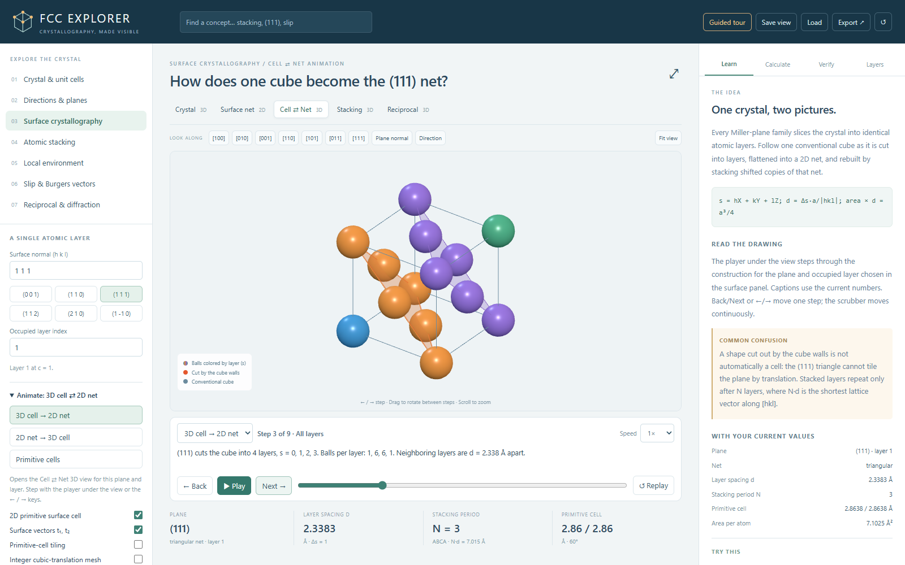
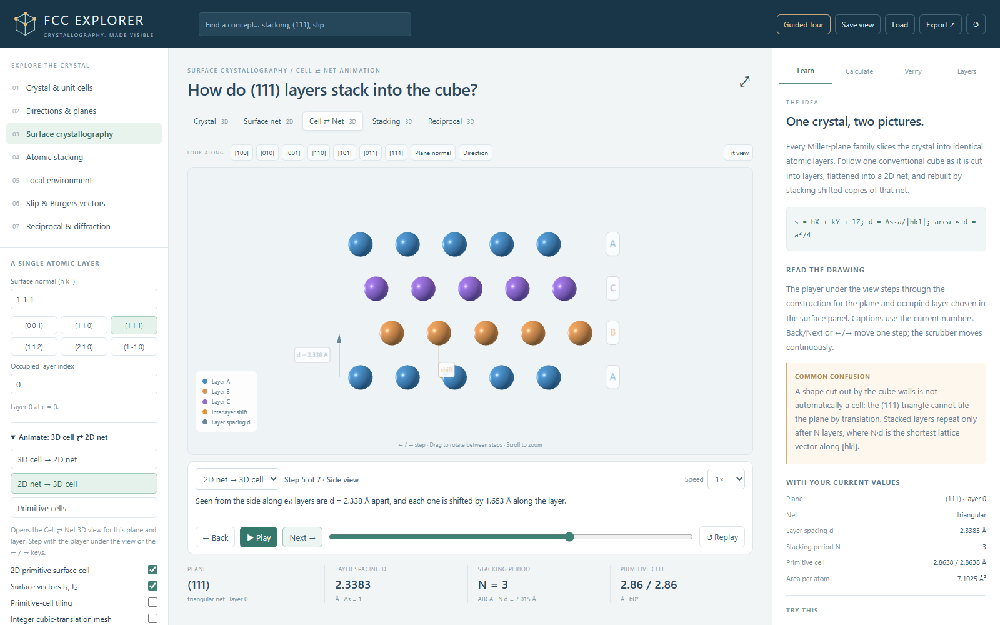
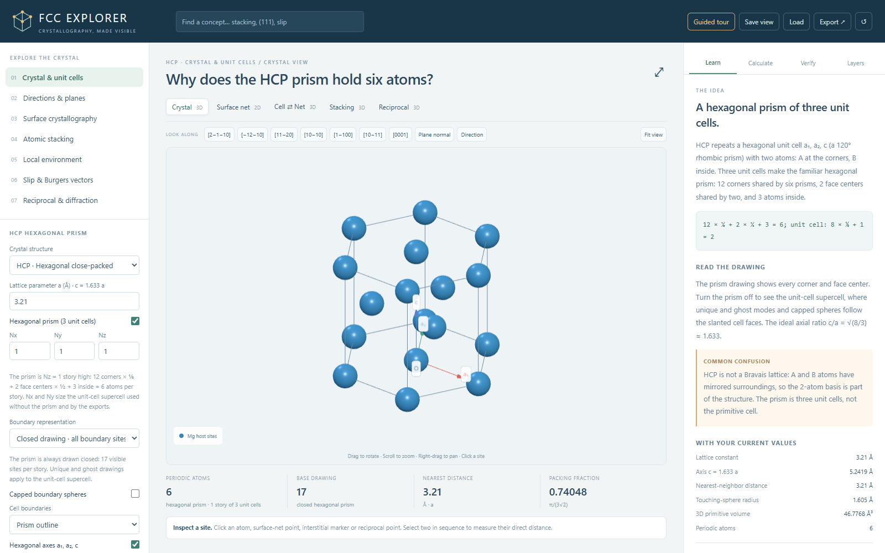
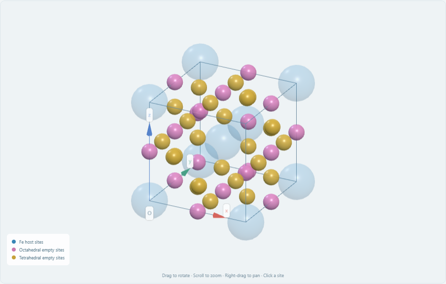
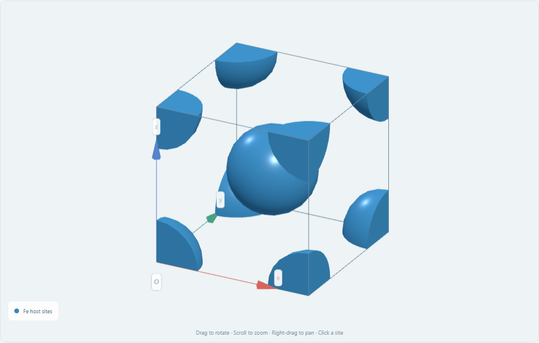
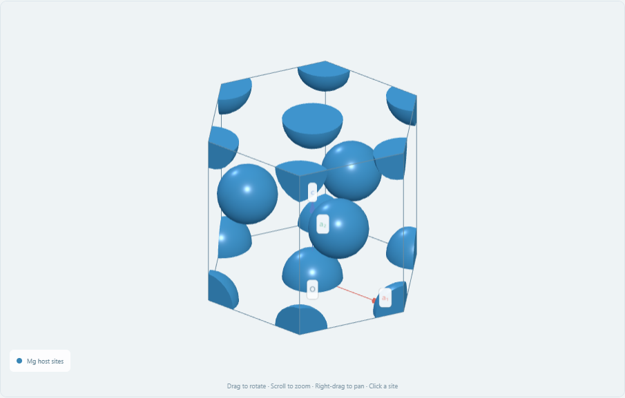
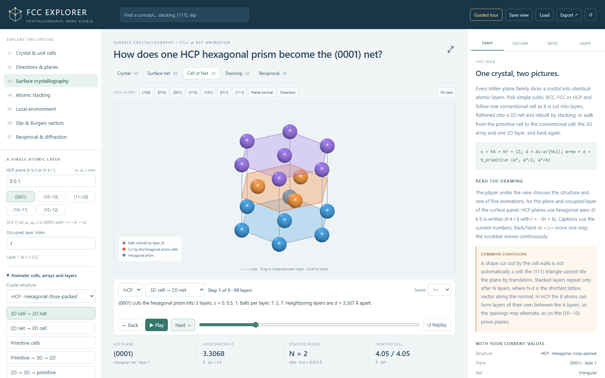
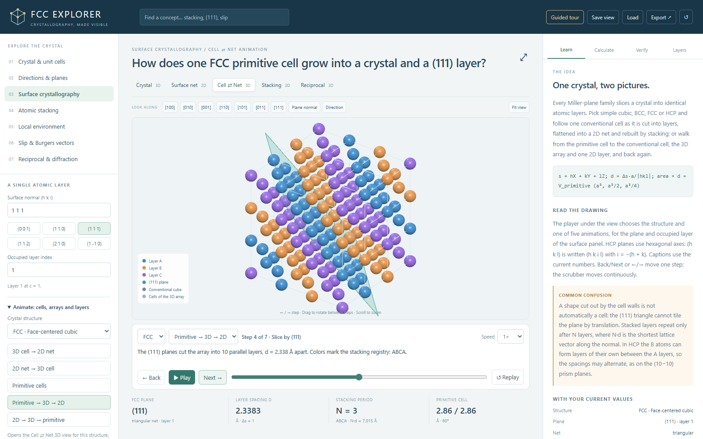

<div align="center">

# FCC Crystallography Explorer

**Crystallography, made visible.**

An interactive 3D lab for crystal structures: face-centered cubic (FCC), plus simple cubic, BCC and HCP. Unit cells, Miller planes, surfaces, stacking, neighbors, slip and diffraction, and every picture comes with its math.

[](LICENSE)
[](https://threejs.org/)


[](https://colab.research.google.com/github/solayman-bd/fcc-crystallography-explorer/blob/main/FCC-Explorer-Colab.ipynb)

**[▶ Try the live demo](https://solayman-bd.github.io/fcc-crystallography-explorer/FCC-Explorer.html)**


</div>

## Why I built this

Textbook pictures of FCC are easy to misread. "4 atoms" and "14 balls" are both right, but they count different things. A plane slice and a projection along [hkl] look alike but show different atoms. The (111) triangle you see in a cube is not the 2D unit cell of a (111) surface. And d(111) is not the repeat distance along [111].

I wrote these points down in my notes, [*Crystal planes in cubic cells: how to see and slice them*](Crystal%20planes%20in%20cubic%20cells%20how%20to%20see%20and%20slice%20them.pdf). Then I built this app so I could set up each object exactly, turn it around, click any atom and check the numbers against the derivation.

## Quick start

### Option 0: use it online

Open the **[live demo](https://solayman-bd.github.io/fcc-crystallography-explorer/FCC-Explorer.html)**. It's the same single file, served by GitHub Pages; everything still runs in your browser.

### Option 1: in your browser (offline)

1. Download or clone this repository.
2. Double-click **`FCC-Explorer.html`**.

That's it. No install, no server, no internet. You need a browser with WebGL2 (any recent Chrome, Edge, Firefox or Safari).

### Option 2: Google Colab

Click the **Open in Colab** badge above. Or:

1. Go to [colab.research.google.com](https://colab.research.google.com/).
2. **File → Upload notebook**, and choose `FCC-Explorer-Colab.ipynb`.
3. **Runtime → Run all**.

A CPU runtime is enough. No GPU, API key, Drive access or package install is needed.

### Option 3: local Jupyter

Open `FCC-Explorer-Colab.ipynb` in Jupyter and run all cells. The last cell also writes the standalone `FCC-Explorer.html` for offline use.

> The notebook embeds the **exact same app** as the HTML file. It checks a SHA-256 hash of the embedded app before it displays anything.

## What you can explore

### Pick the crystal structure first

At the top of **Crystal & unit cells** you choose the structure: **simple cubic, BCC, FCC or HCP**. Every topic, workspace, calculation, check and export follows that choice. Switching structure also switches the example metal (α-Po, α-Fe, Al, Mg and their lattice parameters), unless you have typed your own.

| Structure | Cell drawn | Atoms per cell | Neighbors | Nearest distance | Packing | Primitive cell |
|---|---|---|---|---|---|---|
| **Simple cubic** | cube, 8 sites | 8 × ⅛ = 1 | 6 | a | π/6 ≈ 0.52 | the cube, a³ |
| **BCC** | cube, 9 sites | 8 × ⅛ + 1 = 2 | 8 (+ 6) | a√3/2 | π√3/8 ≈ 0.68 | rhombohedron, 109.47°, a³/2 |
| **FCC** | cube, 14 sites | 8 × ⅛ + 6 × ½ = 4 | 12 | a/√2 | π/(3√2) ≈ 0.74 | rhombohedron, 60°, a³/4 |
| **HCP** (ideal c/a = 1.633) | hexagonal prism, 17 sites (or the a₁, a₂, c unit cell, 9 sites) | 12 × ⅙ + 2 × ½ + 3 = 6 (unit cell: 2) | 12 | a | π/(3√2) ≈ 0.74 | the unit cell, 2 atoms |

HCP uses the hexagonal axes a₁, a₂, c. Planes are shown as (h k i l) and directions as [u v t w]; you can type either three or four indices.

### Seven topics

| Topic | What you can do |
|---|---|
| **Crystal & unit cells** | See visible sites vs. periodic atoms (14 vs. 4 for FCC, 9 vs. 2 for BCC, 17 vs. 6 for the HCP prism). Switch between closed, unique and ghost drawings. Cut boundary atoms into capped pieces, including the ⅙ corners of the HCP prism. Build supercells up to 10×10×10. Overlay the primitive cell, tile it, or show the Wigner–Seitz cell (rhombic dodecahedron, truncated octahedron, cube or hexagonal prism). |
| **Directions & planes** | Enter any `[uvw]` or `(hkl)` from −24 to 24. Place a plane canonically, at the origin, centered, translated or on an occupied atomic layer. Show cubic or hexagonal symmetry families and parallel sets. Add a second plane or direction to check angles and the zone law. |
| **Surface crystallography** | Get the exact 2D primitive surface cell for any `(hkl)`. View one occupied atomic layer as an analytic 2D net with lengths, angle, area and planar density, including HCP layers with 2 atoms per cell. Watch the 3D cell turn into the 2D net and back (see below). |
| **Atomic stacking** | Compare FCC ABC, HCP ABAB and AAA stacking of close-packed layers. Step through intrinsic and extrinsic fault and twin sequences. Filter registries and switch between side and normal views. |
| **Local environment** | Show neighbor shells (FCC 12/6/24, BCC 8/6/12, SC 6/12/8, HCP 12/6/2), including atoms outside the drawn box, and the first-shell hull (cuboctahedron, cube, octahedron, anticuboctahedron). Find the interstitial holes of each structure, their hosts and radius ratios. |
| **Slip & Burgers vectors** | Explore the slip systems: FCC {111}⟨110⟩, BCC {110}⟨111⟩, SC {100}⟨010⟩ and HCP basal, prismatic and pyramidal ⟨a⟩. Compute Schmid factors for any loading direction. See how a perfect vector splits into partials (FCC Shockley, HCP basal). |
| **Reciprocal & diffraction** | View the reciprocal lattice (BCC for FCC, FCC for BCC, simple cubic, hexagonal). See which reflections vanish and why. Compute the structure factor, \|G\|, d and Bragg 2θ for any wavelength (default Cu Kα, 1.5406 Å). |

### Five workspaces

**Crystal (3D)**, **Surface net (2D)**, **Cell ⇄ Net (3D)**, **Stacking (3D)** and **Reciprocal (3D)**. Each 3D view has orthographic and perspective cameras, one-click views along [100], [110], [111] and other directions (for HCP [2−1−10], [11−20], [0001] and others), and an "align to plane normal" button.

### Animated: cells, arrays and layers (SC, BCC, FCC, HCP)

Pick any plane in the **Surface crystallography** panel, then press one of the five animation buttons (or open the **Cell ⇄ Net** tab). A player under the view steps through the construction. Every caption is filled from the geometry of your structure, plane, layer and lattice parameter.

The animations use the structure chosen in Crystal & unit cells:

| Structure | Conventional cell | Primitive cell |
|---|---|---|
| **Simple cubic** | cube, 8 corners → 1 atom | the cube itself, a³ |
| **BCC** | cube, 8 corners + 1 body center → 2 atoms | rhombohedron, (√3/2)a, 109.47°, a³/2 |
| **FCC** | cube, 8 corners + 6 face centers → 4 atoms | rhombohedron, a/√2, 60°, a³/4 |
| **HCP** (ideal c/a = 1.633) | hexagonal prism, 12 corners + 2 face centers + 3 inside → 6 atoms | rhombic prism a₁, a₂, c with 2 atoms (the basis) |

| Mode | What it shows |
|---|---|
| **3D cell → 2D net** | The conventional cell (14 balls for the FCC cube, 17 for the HCP prism) → the plane cutting it → every layer colored, with d → the view along the normal ("picture B", e.g. 13 spots for 14 balls in FCC (111)) → one layer with true distances ("picture A") → the layer grown into an infinite net → why the cell cut is or isn't a cell of the net → the primitive and centered cells → the same orientation as the Surface net 2D view. |
| **2D net → 3D cell** | One layer → the next layer dropping in, shifted onto the gaps → stacking until the registry repeats (ABAB for FCC (001), ABC for (111), AAA for SC (001), ABAB for HCP (0001), period N in general) → a side view with d and the shift → back to the cell, where exactly 8 / 9 / 14 / 17 balls fill one SC / BCC / FCC cube or HCP prism. |
| **Primitive cells** | The centered 2D cell morphing into the primitive cell (area halves, 2 atoms → 1), then the conventional cell, its a₁, a₂, a₃ (a₁, a₂, c for HCP) and the primitive cell. For BCC you see that part of the primitive cell sticks out of the cube. |
| **Primitive → 3D → 2D** | The primitive cell → the conventional cell → a 3D array of cells (3 × 3 × 3 cubes, or 7 hexagonal prisms in 3 stories) → the array sliced by (hkl), colored by stacking registry → the layers pulled apart → one layer seen face-on → that layer grown into the infinite 2D net with t₁, t₂. |
| **2D → 3D → primitive** | The same path backwards: one 2D layer → copies stacked along the normal → the gaps closed into the 3D array → the repeating cells → one conventional cell → the primitive cell. |

It works for every `(hkl)`: the layer spacing, net, interlayer shift and stacking period are computed, never hard-coded. For HCP you type (h k l) on the axes a₁, a₂, c, or the four-index (h k i l) with i = −(h + k). There, the B atoms can form layers of their own between the A layers, so spacings can alternate (a√3/6 and a√3/3 on the (10−10) prism planes), and a layer can hold 2 atoms per cell (11−20). Controls: Back / Next (or ←/→), Play/Pause, Replay, a timeline scrubber and speed (0.5×, 1×, 2×). It respects your system's reduced-motion setting.

### Built for learning

- **Guided tour** with 18 lessons, built around FCC with one BCC and one HCP lesson: conventional FCC cell → counting shared atoms → 3D primitive cell → directions & translations → Miller planes → low-index surfaces → 2D primitive cells → 3D cell → 2D net → 2D net → 3D cell → primitive cells, step by step → primitive cell → 3D array → 2D layer → BCC: 2D layer → primitive cell → HCP: ABAB stacking → ABC stacking → neighbors & coordination → interstitial sites → slip systems → reciprocal space & diffraction.
- **21 presets**, such as *The (111) plane*, *FCC (110)*, *Twelve nearest neighbors*, *Shockley partial vectors* and six animations. Presets follow the selected structure (*BCC (110)*, *Eight nearest neighbors*, *HCP (0001)*…); the partial-vector preset is offered for FCC and HCP.
- **Four side tabs**:
  - **Learn**: the idea, the equation, how to read the drawing and a common misconception, written for the selected structure.
  - **Calculate**: the derived values for your current settings.
  - **Verify**: live invariant checks.
  - **Layers**: turn each drawing group on or off.
- **Concept search**: type "stacking", "(111)" or "slip" and jump to the right view.
- **Click any atom** to see its conventional fractions, Cartesian Å, supercell fractions, periodic image and plane membership. Click a second atom to get the distance between them.

## Screenshots

| The (111) plane in the conventional cell | Exact 2D net of one FCC (111) layer |
|---|---|
|  |  |

| ABC stacking along [111] | The (001) net: primitive cell vs. the a × a cube face |
|---|---|
|  |  |

| Cell ⇄ Net: the (111) layers inside one cube | Cell ⇄ Net: (111) layers stacking ABCA, side view |
|---|---|
|  |  |

| Choosing the structure: HCP and its hexagonal prism | BCC: interstitial holes (octahedral pink, tetrahedral gold) |
|---|---|
|  |  |

| BCC: counting 8 × ⅛ + 1 = 2 with capped spheres | HCP prism: counting 12 × ⅙ + 2 × ½ + 3 = 6 |
|---|---|
|  |  |

| Cell ⇄ Net, HCP: the hexagonal prism cut into (0001) layers A, B, A | Primitive → 3D → 2D: a 3 × 3 × 3 FCC array sliced into (111) layers |
|---|---|
|  |  |

## Key numbers it shows

For FCC with the default lattice parameter **a = 4.05 Å** (editable):

| Quantity | Formula | Value |
|---|---|---|
| Atoms per conventional cell | 8 × ⅛ + 6 × ½ | 4 |
| Visible sites in a closed 1×1×1 drawing | 8 corners + 6 faces | 14 |
| Nearest-neighbor distance | a/√2 | 2.8638 Å |
| Touching-sphere radius | a√2/4 | 1.4319 Å |
| Coordination number | | 12 |
| Packing fraction | π/(3√2) | 0.74048 |
| Primitive cell volume | a³/4 | 16.6075 ų |
| (111) layer spacing | a/√3 | 2.3383 Å |
| Pure repeat along [111] (ABC) | √3·a | 7.0148 Å |
| Slip systems | 4 {111} × 3 ⟨110⟩ | 12 |

### Checked live in the app

The **Verify** tab recomputes 26 invariants for FCC (22 for simple cubic and BCC, 23 for HCP) for your current settings. For FCC they include:

- 4 unique atoms and 14 visible sites
- primitive volume a³/4
- 12 / 6 / 24 neighbor shells
- both surface vectors lie in the plane and are lattice translations
- surface area × layer gap = a³/4
- 12 distinct slip systems, all Schmid factors ≤ 0.5
- (111) allowed and (100) absent
- reciprocal duality error ≈ 0
- for the current plane: stacking period N × d = the shortest lattice vector along [hkl], d × 4/a³ = planar density, and exactly 14 stacked balls in one cube
- the same plane in the other animated structures: 8 stacked balls in one SC cube, 9 in one BCC cube, 17 in one HCP prism, and HCP layer area × lattice-layer step = (√3/2)a²c

For simple cubic, BCC and HCP the same kinds of checks use that structure's own numbers: its atom counts, primitive volume and angle, neighbor shells, slip-system count, selection rule (BCC (110) allowed and (100) absent; HCP (0002) allowed and (0001) absent), pure repeat and layer stacks.

## Save, load and export

| Action | What you get |
|---|---|
| **Save view / Load** | A `.json` file with all settings and the camera. Load it later to restore the exact view. |
| **PNG** | The current view (2D or 3D). |
| **SVG** | The analytic 2D surface net. |
| **Calculation report** | A Markdown report with parameters, equations, derived values and checks. |
| **XYZ / CIF / POSCAR** | Unique atoms of the configured **ideal bulk supercell** of the selected structure (for HCP, of a₁, a₂, c unit cells with γ = 120°), for use in VESTA, OVITO, ASE, VASP and similar tools. Ghost atoms, holes and the stacking comparisons (faults, twins, reciprocal points) are never exported. |

## Repository contents

```
├── FCC-Explorer.html              # Ready-to-run app: one self-contained file, works offline
├── FCC-Explorer-Colab.ipynb       # The same app inside a Colab/Jupyter notebook
├── index.html                     # Sends GitHub Pages visitors to the app
├── src/                           # Source code (see "Project structure" below)
├── tests/                         # Unit tests and a browser smoke test
├── build.mjs                      # Bundles src/ into one offline HTML file
├── make_notebook.py               # Packs the HTML into the Colab/Jupyter notebook
├── serve.py                       # Optional localhost launcher
├── package.json, package-lock.json
├── FCC-Requirements-Analysis.md   # My design decisions and the full math model
├── FCC-Build-Specification.md     # The specification I built the app against
├── Crystal planes in cubic cells how to see and slice them.pdf
│                                  # My notes on slicing and viewing crystal planes
├── instruction.txt                # Short run instructions
├── docs/screenshots/              # Images used in this README
├── LICENSE, THIRD_PARTY_NOTICES.md
└── README.md
```

### Project structure

```
src/
├── app.js                   # Entry point: settings, panels and user input
├── state.js                 # Defaults, allowed values and validation of every setting
├── exports.js               # XYZ / CIF / POSCAR files and the calculation report
├── crystal/                 # Pure crystallography, no rendering
│   ├── math.js              #   vectors, GCD/Bézout, index parsing, cubic symmetry
│   ├── lattice.js           #   FCC sites, primitive cell, directions, metrics
│   ├── planes.js            #   located Miller planes, spacings, plane/box intersection
│   ├── surfaces.js          #   exact 2D primitive surface cells (integer kernel + Gauss reduction)
│   ├── structures.js        #   SC, BCC, FCC and HCP as lattice + basis; (h k i l) indices
│   ├── bulk.js              #   the selected structure: sites, neighbors, holes, planes, slip, diffraction
│   ├── layers.js            #   layers of any plane in those structures: spacing, net, shift, period, cell cuts, 3D arrays
│   ├── environment.js       #   neighbor shells, interstitial holes, Wigner–Seitz cell
│   ├── slip.js              #   12 slip systems, Schmid factors, Shockley partials
│   ├── stacking.js          #   ABC / ABAB / AAA and fault/twin sequences
│   ├── reciprocal.js        #   reciprocal lattice, selection rule, Bragg geometry
│   └── verify.js            #   live invariant checks (the Verify tab)
├── visualization/
│   ├── geometry.js          #   capped boundary spheres, polygon meshes
│   ├── viewer.js            #   Three.js 3D viewer with picking
│   ├── cell-net.js          #   the Cell ⇄ Net animations (steps, tweens, captions)
│   └── surface-view.js      #   analytic SVG view of one atomic layer
├── education/concepts.js    # Explanations, guided tour, presets, references
├── index.html               # Page template
└── styles.css
```

## Build from source

`FCC-Explorer.html` in the repository root is the ready-to-use build, so you don't need any of this just to run the app.

To change the code you need [Node.js](https://nodejs.org/) 20 or newer (and Python 3 for the notebook):

```bash
npm install            # Three.js, esbuild, Prettier, Playwright (exact versions in package-lock.json)
npm run build          # src/ -> dist/FCC-Explorer.html
npm test               # unit tests for the crystallography engine
npm run notebook       # dist/FCC-Explorer.html -> dist/FCC-Explorer-Colab.ipynb
npm run test:browser   # opens the built app in Chrome or Edge and checks presets, tour, exports
npm run serve          # optional: serve the build on localhost
```

The unit tests check the identities the app relies on: 4 atoms per cell with 14 visible sites, primitive volume a³/4, the three different plane spacings, a primitive surface cell (area × layer gap = a³/4) for all 2,196 signed index triples within ±6, neighbor shells of 12/6/24, hole hosts, the 12 slip systems and their Schmid factors, ABC stacking mapping back onto the cubic lattice, reciprocal duality, the FCC selection rule, capped-sphere volumes of ½, ¼ and ⅛, settings validation and export atom counts.

For simple cubic, BCC and HCP they check the unit-cell and HCP-prism counts, neighbor shells (from A and B atoms in HCP), hole counts, host distances and radius ratios, the Wigner–Seitz cells, shortest translations, hexagonal symmetry families, slip systems (|b| equal to the nearest-neighbor distance, b in the slip plane, zero Schmid factors along [0001] for HCP ⟨a⟩ slip), partial-vector sums, structure factors, exports and every Verify check.

For the Cell ⇄ Net animations they check this FCC table, plus: N interlayer shifts (and no fewer) add up to a net vector, (1 −1 0) behaves like (110), (002) reduces to (001), and the stacked layers put exactly 14 balls in one cube for every plane tested. For simple cubic, BCC and HCP they check matching tables (for example BCC (110): a centered-rectangular net at 70.53° with N = 2; HCP (0001): ABAB with d = c/2; HCP (10−10): gaps a√3/6 and a√3/3 with N = 4). For all four structures and all 342 index triples within ±3, they also check that layer area × lattice-layer step equals the primitive volume, that N·d equals the shortest lattice vector along the normal, and that the stacked layers fill one cell with exactly 8, 9, 14 or 17 balls.

| (hkl) | d | Primitive net | Area per atom | Period N |
|---|---|---|---|---|
| (001) | a/2 | a/√2, a/√2, 90° | a²/2 | 2 |
| (110) | a/(2√2) | a/√2, a, 90° | a²/√2 | 2 |
| (111) | a/√3 | a/√2, a/√2, 60° | √3a²/4 | 3 |
| (112) | a/(2√6) | a/√2, a√3, 90° | a²√(3/2) | 6 |
| (210) | a/(2√5) | a, a√(3/2), 65.9° | a²√5/2 | 10 |

When you're happy with a change, copy `dist/FCC-Explorer.html` and `dist/FCC-Explorer-Colab.ipynb` over the files in the repository root.

## How it works

- **Engine:** dependency-free JavaScript for the crystallography. Surface cells come from an exact integer kernel in the primitive basis followed by unimodular Gauss reduction, not from a bounded search. Simple cubic, BCC and HCP are described as a lattice + basis, so the same exact methods give their layers, nets, neighbors and diffraction. FCC keeps its original dedicated code, and a differential test confirms its views, numbers and exports are unchanged.
- **3D:** [Three.js](https://threejs.org/) 0.180.0 with instanced meshes for picking and capped sphere sections at cell boundaries.
- **2D:** SVG, drawn from an analytic projection of one atomic layer.
- **Packaging:** esbuild for the single-file bundle, and Python (standard library + IPython) for the notebook. The notebook checks the SHA-256 of the embedded app, so both editions always run the same code.
- **Privacy:** no backend, login, telemetry, CDN or external fonts. Everything runs in your browser.

The full math model is in [FCC-Requirements-Analysis.md](FCC-Requirements-Analysis.md), including lattice conventions, the three different plane spacings, the surface derivation, stacking frames, neighbor shells, slip and reciprocal space.

## Scope and limits

This app models **ideal, monatomic simple cubic, BCC, FCC and HCP geometry** for teaching. HCP uses the ideal axial ratio c/a = √(8/3). The element symbol is only a label, and the radius is a hard-sphere construction.

It does **not** simulate:

- relaxed defects, dislocation cores or stacking-fault energies
- phonons, surface reconstruction or adsorption
- real X-ray intensities or dynamical diffraction
- imported crystal structures, or non-ideal HCP axial ratios

Fault, twin and partial-dislocation views are exact geometric constructions, not relaxed simulations.

## Troubleshooting

- **The 3D view is blank.** The 3D views need WebGL2. Turn on hardware acceleration in your browser settings, or try another browser. The 2D surface net, calculations and exports still work without it.
- **Nothing shows in the notebook.** Some viewers block active output until you trust or run the notebook. Run all cells, or use the last cell to download the standalone HTML.
- **A plane doesn't appear.** A plane with negative indices may lie outside the positive box. The app shows a message instead of moving the plane. Try the *centered* location.

## References

- [IUCr: Miller indices](https://dictionary.iucr.org/Miller_indices)
- [IUCr: reciprocal lattice](https://www.iucr.org/what-we-do/education/pamphlets/reciprocal-lattice)
- [IUCr: structure factor](https://dictionary.iucr.org/Structure_factor)
- [IUCr: Wigner–Seitz cell](https://dictionary.iucr.org/Wigner-Seitz_cell)
- [Kiel University: partial dislocations and stacking faults](https://www.tf.uni-kiel.de/matwis/amat/def_en/kap_5/backbone/r5_4_1.html)
- [Kiel University: Burgers vectors](https://www.tf.uni-kiel.de/matwis/amat/def_en/kap_5/backbone/r5_1_2.html)

## License

[MIT](LICENSE). The app bundles [Three.js](https://github.com/mrdoob/three.js) (MIT). See [THIRD_PARTY_NOTICES.md](THIRD_PARTY_NOTICES.md); the same notices are included at the top of `FCC-Explorer.html`.
